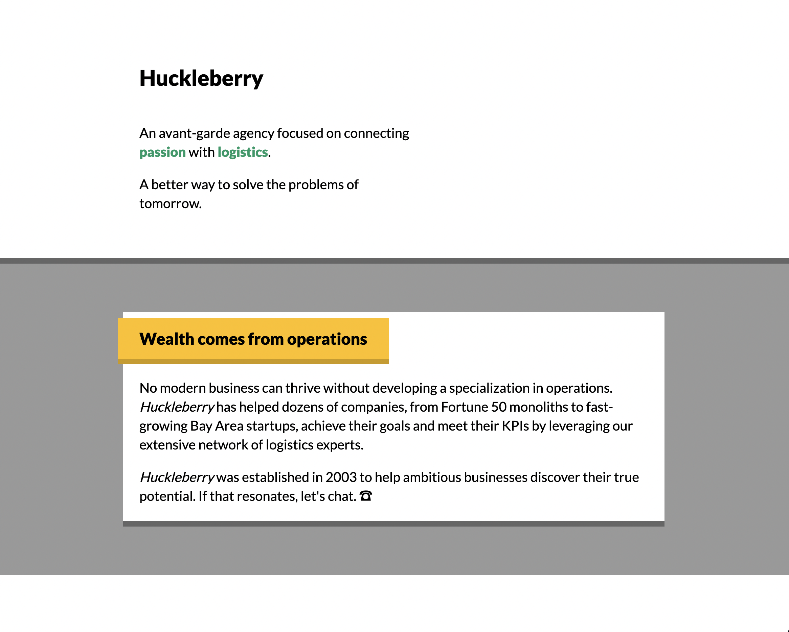
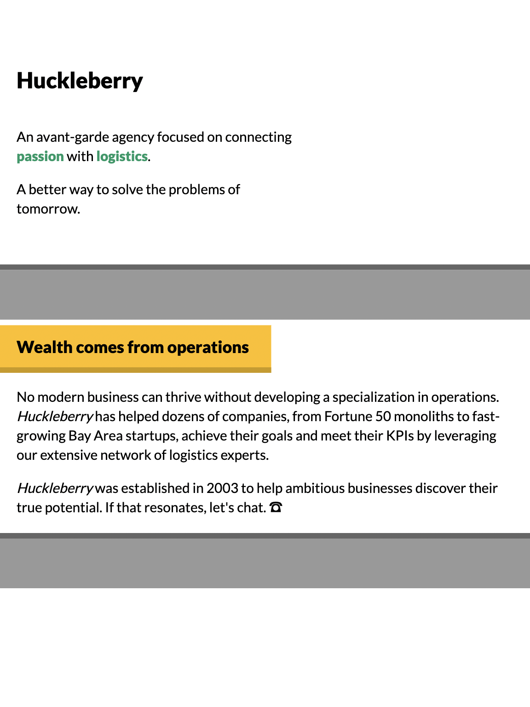
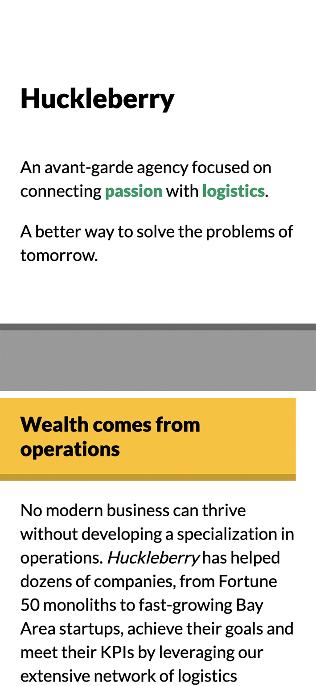
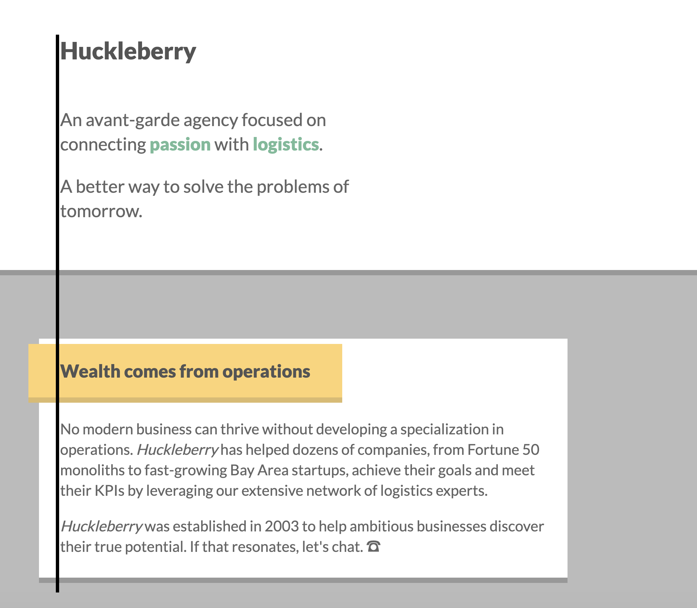

# Huckleberry Agency Website

In this workshop, you'll build a minimal landing page for an agency.

This mockup is built entirely using _flow layout_: no Flexbox, no grid, no absolute positioning. It relies heavily on padding, margin, and border.

## Mockups

Desktop:



Tablet:



Mobile:



## Setup Instructions

This project uses an NPM package called "live-server" — it provides a basic local file server, so that you can view the HTML file in-browser, and automatically reloads the page when the HTML/CSS changes.

Start by installing dependencies:

```
npm install
```

Run the "start" script to start the server:

```
npm run start
```

You should see a confirmation message like this:


You can visit `http://localhost:5000` to view the page. You should see a bunch of unstyled content:


> **Trouble with this process?**
>
> Because this project is vanilla HTML and CSS, you can always open the HTML file in your browser, without fussing with a local file server.
>
> Certain JS APIs won't work when viewing files in this way, but that isn't a concern for this project.

---

## Getting Started Notes

- You're given a decent start in terms of the HTML markup, but not much in the way of styles. You'll be expected to edit `style.css` to implement the styles. You can also edit `index.html` if you wish, though it should be possible to solve this project touching only `style.css`.

- Don't worry too much about "best practices". Later in this course, we'll see how to create scalable encapsulated styles. For now, the goal is simply to implement the designs in the screenshots, with whatever organizational strategy comes most naturally to you.

- You may be tempted to reach for CSS strategies we haven't yet seen in the course, like flexbox or absolute positioning. Please try and complete this workshop without them. This module is focused on flow-layout and the box-model, and it is possible to lay everything out on the page using only padding, border, and margin. It's important to be comfortable with these primitives before moving on to more-complex subjects.

- Future workshops will provide a React starter. For the early workshops, the focus is on the fundamentals, so we're using pure HTML and CSS. If you feel more comfortable using a JS framework like React, you can go ahead, but please don't use any component libraries or CSS frameworks. All CSS should be written by hand.

- **Pay close attention to alignment.** For example, you should be able to draw a line along the left, and all text should be neatly aligned:



That said: Don't worry if you can't create a pixel-perfect recreation. In the solution video, I'll show you exactly how I did it. Spend an hour or so on this project, and submit whatever you have at that point.

## Design tokens

In the early days of the web, sites would be built largely on "feel". Colors and sizes would be chosen based on the whims of the moment. This led to some very inconsistent-looking websites!

Nowadays, it's common to have a set of _design tokens_. A design token is a value that can be reused. Typically it's part of a collection or a scale.

We'll learn more about this idea later, but for now, you can copy/paste the values from this list as-needed. Don't worry about being DRY or using variables; Plop these values in, wherever you need them.

**If you find it difficult to use these tokens, or if you're not able to achieve a result you're happy with, don't worry about it.** Solve it however you can, and then watch the solution video to see how I did it.

### Spacing

This app uses an 8px unit. All spaces are a multiple of 8px:

- `8px`
- `16px`
- `24px`
- `32px`
- `48px`
- `64px`
- `96px`
- `128px`

When it comes to max widths (eg. the maximum width of the card), arbitrary values can be used.

### Font

1 font is used in this project: `Lato`. It is already included in the stylesheet.

For font sizes, the `rem` unit should be used.

The scale is:

- `1rem`
- `1.25rem`
- `1.5rem`
- `2rem`

Because the base font size is 18px, this works out in pixels to:

- `18px`
- `22.5px`
- `27px`
- `36px`

### Color palette

Primary (green):

- `hsl(160deg, 100%, 30%)`

Secondary (gold):

- `hsl(45deg, 100%, 50%)` (lighter)
- `hsl(45deg, 100%, 40%)` (darker)

Grays:

- `hsl(0deg, 0%, 0%)` (black)
- `hsl(0deg, 0%, 10%)` (very dark)
- `hsl(0deg, 0%, 30%)` (dark)
- `hsl(0deg, 0%, 40%)` (medium)
- `hsl(0deg, 0%, 60%)` (light)
- `hsl(0deg, 0%, 100%)` (white)

> What the HSL?
>
> You may be more familiar with color values in hexadecimal format, like `#FF0000`. In Module 0's "color" lesson, we go over what HSL color is and how it works. If you haven't already, it's worth reviewing before getting started!

## Submissions

**Workshops are submitted through the course platform.** Commit your changes, push them to your fork, and submit the link by clicking the "Complete lesson" button on the workshop page.

If you're not comfortable with Git, you can upload a `.zip` file using Dropbox or Google Drive, and paste a link to the public file instead.
